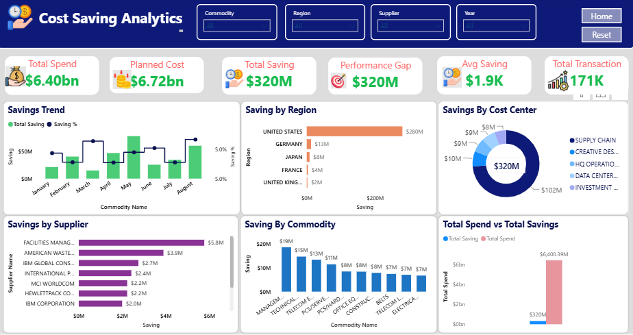

 # Procurement 360 — Spend Analytics Suite

Project Overview

This project provides a comprehensive procurement analytics solution designed to help organizations monitor spending patterns, identify savings opportunities, improve supplier performance, and reduce procurement inefficiencies.

The dashboard enables procurement teams to make data-driven decisions through interactive visualizations and KPI tracking.

Business Problem-

Organizations often face challenges such as:

Uncontrolled procurement spending
Limited visibility into supplier performance
Maverick spending outside approved processes
High tail-spend across small suppliers
Difficulty tracking cost-saving initiatives

This dashboard helps procurement teams monitor spending behavior and identify optimization opportunities.

Tools Used
Power BI
Power Query
DAX
Excel
Data Modeling

Dashboard Modules
1. Cost Saving Analytics

Key Metrics:

Total Spend
Planned Cost
Total Savings
Performance Gap
Average Savings
Total Transactions

Insights:

Track cost reduction initiatives.
Identify regions and suppliers generating maximum savings.
Monitor savings performance against targets.

2. Indirect Spend Management

 

Key Metrics:

Indirect Spend
Indirect Spend %
Average Indirect Spend
Commodity Count
Savings

Insights:

Analyze indirect procurement categories.
Track budget versus actual spending.
Identify high-spending cost centers.

3. Maverick Spend Analysis

 

Key Metrics:

Maverick Spend
Maverick Spend %
Compliance Rate
Non-Compliant Transactions

Insights:

Identify purchases made outside approved procurement channels.
Monitor procurement compliance.
Reduce unauthorized spending.

4. Supplier Analysis

Key Metrics:

Total Suppliers
Active Suppliers
Average Supplier Spend
YOY Growth

Insights:

Evaluate supplier performance.
Analyze supplier concentration.
Monitor spend growth trends.

5. Tail Spend Analysis

Key Metrics:

Tail Spend
Tail Spend %
Small Suppliers
Consolidation Opportunities

Insights:

Identify low-value purchases.
Reduce supplier fragmentation.
Improve procurement efficiency through supplier consolidation.
Key Business Insights

✔ Achieved $320M cost savings.

✔ Identified high maverick spend regions impacting compliance.

✔ Highlighted supplier consolidation opportunities worth $73M.

✔ Analyzed spend across 255 procurement commodities.

✔ Tracked 171K procurement transactions.

✔ Monitored supplier performance across multiple regions and cost centers.

Download file from here [ADVANCED-SPEND-ANALYTICS-project-with-Document.pbix] (ADVANCED-SPEND-ANALYTICS-project-with-Document.pbix)
